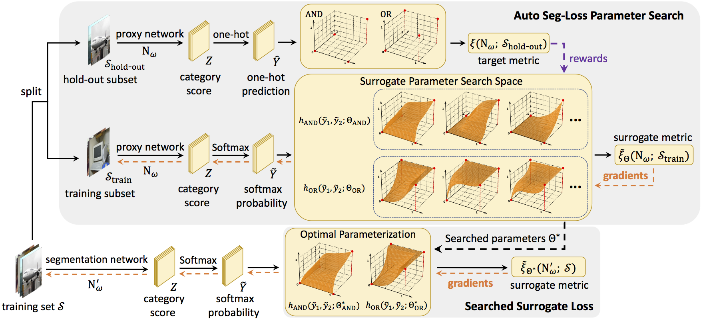
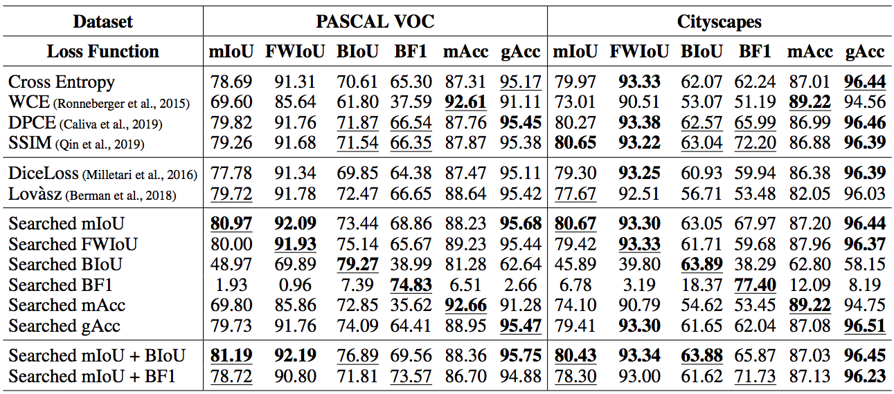

# Auto-Seg-Loss

By [Hao Li](https://scholar.google.com/citations?user=qHqQsY4AAAAJ&hl=zh-CN), [Chenxin Tao](https://scholar.google.com/citations?user=sXHFIBkAAAAJ&hl=zh-CN), [Xizhou Zhu](https://scholar.google.com/citations?user=02RXI00AAAAJ), [Xiaogang Wang](http://www.ee.cuhk.edu.hk/~xgwang/), [Gao Huang](http://www.gaohuang.net/), [Jifeng Dai](https://jifengdai.org/)

This is the official implementation of the ICLR 2021 paper [Auto Seg-Loss: Searching Metric Surrogates for Semantic Segmentation](https://arxiv.org/abs/2010.07930).  

## Introduction

**TL; DR.** 

Auto Seg-Loss is the first general framework for searching surrogate losses for mainstream semantic segmentation metrics.


**Abstract.** 

Designing proper loss functions is essential in training deep networks. Especially in the field of semantic segmentation, various evaluation metrics have been proposed for diverse scenarios. Despite the success of the widely adopted cross-entropy loss and its variants, the mis-alignment between the loss functions and evaluation metrics degrades the network performance. Meanwhile, manually designing loss functions for each specific metric requires expertise and significant manpower. In this paper, we propose to automate the design of metric-specific loss functions by searching differentiable surrogate losses for each metric. We substitute the non-differentiable operations in the metrics with parameterized functions, and conduct parameter search to optimize the shape of loss surfaces. Two constraints are introduced to regularize the search space and make the search efficient. Extensive experiments on PASCAL VOC and Cityscapes demonstrate that the searched surrogate losses outperform the manually designed loss functions consistently. The searched losses can generalize well to other datasets and networks.





## License

This project is released under the [Apache 2.0 license](./LICENSE).

## Citing Auto Seg-Loss
If you find Auto Seg-Loss useful in your research, please consider citing:
```bibtex
@inproceedings{li2020auto,
  title={Auto Seg-Loss: Searching Metric Surrogates for Semantic Segmentation},
  author={Li, Hao and Tao, Chenxin and Zhu, Xizhou and Wang, Xiaogang and Huang, Gao and Dai, Jifeng},
  booktitle={ICLR},
  year={2021}
}
```

## Configs

### PASCAL VOC Search experiments 

| Target Metric | mIoU | FWIoU | mAcc | gAcc | BIoU | BF1 |
| :------------: | :----: | :----: | :----: | :----: | :----: | :----: |
| **Parameterization** | bezier | bezier | bezier | bezier | bezier | bezier |
| **URL** | [config](./ASL_configs/search/miou_bezier_lr=0.2_eps=0.2.py) | [config](./ASL_configs/search/fwiou_bezier_lr=0.2_eps=0.2.py) | [config](./ASL_configs/search/macc_bezier_lr=0.2_eps=0.2.py) | [config](./ASL_configs/search/gacc_bezier_lr=0.2_eps=0.2.py) | [config](./ASL_configs/search/biou_bezier_lr=0.2_eps=0.2.py) | [config](./ASL_configs/search/bf1_bezier_lr=0.2_eps=0.2.py) |

### PASCAL VOC Re-training experiments

| Target Metric | mIoU | FWIoU | mAcc | gAcc | BIoU | BF1 |
| :------------: | :----: | :----: | :----: | :----: | :----: | :----: |
| Cross Entropy | 78.69 | 91.31 | 87.31 | 95.17 | 70.61 | 65.30 |
| ASL | 80.97 | 91.93 | 92.95 | 95.22 | 79.27 | 74.83 |
| URL | [config](./ASL_configs/retrain/miou_bezier_10k.py)<br/>[log](./ASL_configs/retrain/miou_bezier_10k.log) | [config](./ASL_configs/retrain/fwiou_bezier_10k.py)<br/>[log](./ASL_configs/retrain/fwiou_bezier_10k.log) | [config](./ASL_configs/retrain/macc_bezier_10k.py)<br/>[log](./ASL_configs/retrain/macc_bezier_10k.log) | [config](./ASL_configs/retrain/gacc_bezier_10k.py)<br/>[log](./ASL_configs/retrain/gacc_bezier_10k.log) | [config](./ASL_configs/retrain/biou_bezier_10k.py)<br/>[log](./ASL_configs/retrain/biou_bezier_10k.log) | [config](./ASL_configs/retrain/bf1_bezier_10k.py)<br/>[log](./ASL_configs/retrain/bf1_bezier_10k.log) |


<sub><sup>*Note:*</sup></sub>

<sub><sup>1. The search experiments are conducted with R50-DeepLabV3+.  </sup></sub>   

<sub><sup>2. The re-training experiments are conducted with R101-DeeplabV3+.  </sup></sub>   


## Installation

Our implementation is based on [MMSegmentation](https://github.com/open-mmlab/mmsegmentation/).

### Prerequisites
  
- Python>=3.7

    We recommend you to use Anaconda to create a conda environment:
    ```bash
    conda create -n auto_segloss python=3.8 -y
    ```
    Then, activate the environment:
    ```bash
    conda activate auto_segloss
    ```
  
- PyTorch>=1.7.0, torchvision>=0.8.0 (following [official instructions](https://pytorch.org/)).

    For example, if your CUDA version is 10.1, you could install pytorch and torchvision as follows:
    ```bash
    conda install pytorch=1.8.0 torchvision=0.9.0 cudatoolkit=10.1 -c pytorch
    ```
    
- MMCV>=1.3.0 (following [official instruction](https://github.com/open-mmlab/mmcv/tree/master/docs)).
    
    We recommend installing the pre-built `mmcv-full`. For example, if your CUDA version is 10.1 and pytorch version is 1.8.0, you could run:
    ```bash
    pip install mmcv-full -f https://download.openmmlab.com/mmcv/dist/cu101/torch1.8.0/index.html
    ```
    
### Installing the modified mmsegmentation

```bash
git clone https://github.com/fundamentalvision/Auto-Seg-Loss.git
cd Auto-Seg-Loss
pip install -e .
```

## Usage

### Dataset preparation

Please follow the [official guide](https://github.com/open-mmlab/mmsegmentation/blob/master/docs/dataset_prepare.md) of MMSegmentation to organize the datasets. It's highly recommended to symlink the dataset root to `Auto-Seg-Loss/data`. The recommended data structure is as follows:

```none
Auto-Seg-Loss
├── mmseg
├── ASL_search
└── data
    └── VOCdevkit
        ├── VOC2012
        └── VOCaug
```


### Training models with the provided parameters

The re-training command format is 

```
./ASL_retrain.sh {CONFIG_NAME} [{NUM_GPUS}] [{SEED}]
```

For example, the command for training a ResNet-101 DeepLabV3+ with 4 GPUs for mIoU is as follows:

```
./ASL_retrain.sh miou_bezier_10k.py 4
```

You can also follow the provided configs to modify the mmsegmentation configs, and use Auto Seg-Loss for training other models on other datasets.


### Searching for semantic segmentation metrics

The search command format is 

```
./ASL_search.sh {CONFIG_NAME} [{NUM_GPUS}] [{SEED}]
```

For example, the command for searching for surrogate loss functions for mIoU with 8 GPUs is as follows:

```
./ASL_search.sh miou_bezier_lr=0.2_eps=0.2.py 8
```

